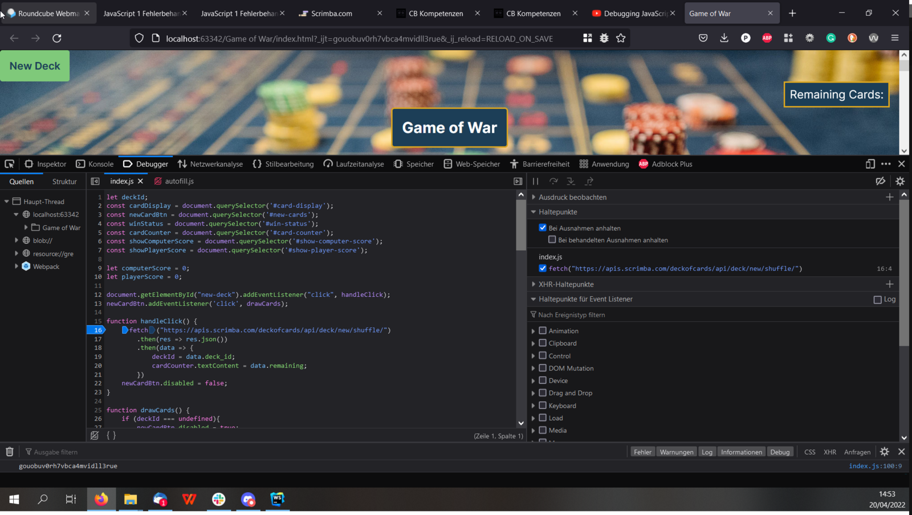

# Error Handling

### The debugger is your friend
All modern browsers provide excellent developer tools.
- Open the developer tools (in common browsers):
- Right-click and select "Inspect", Keyboard shortcut: `Ctrl + Shift + I`

- Here's a helpful video on JavaScript debugging in Chrome:
    - [JavaScript Debugging in Chrome](https://www.youtube.com/watch?v=H0XScE08hy8)

### Try, Catch
<u>Creating exceptions for runtime errors:</u>

- In the `try` block, the program attempts to perform the desired action.
- A `try` block should never stand alone. It must be followed by a `catch` block.
- In case of a runtime error, JavaScript automatically creates an "Error" object containing details about the problem (see the 2nd `catch` block in the example below):

```javascript
let a = 1.123456789123456789123456789;
let x = prompt("How many digits should be displayed?");
try {
    // Reduces the number of decimal places to the number
    // specified by the user
    let b = a.toPrecision(x);
    console.log("Value with the desired precision: " + b + "<br>")
}
catch {
    console.log("Enter a value between 1 and 100!");
}
console.log("Further content");
// Alternative for catch block
// Using err, you can access the error object, where name is the name of the error
// Attribute message is the error message
catch(err) {
    console.error(err.name);
    console.error(err.message);
}
```

### `console.log()` is your friend
* Outputs a message to the web console.
* Extremely helpful for debugging.
* Advantage over `alert`: JavaScript program can continue running without pausing (the `alert()` command pauses the program).

**Examples of `console.log()`:**

```javascript
let testString = "Hello";
console.log(testString);

let fruits = ["Apple", "Banana", "Kiwi"];
console.log(fruits);
console.log(fruits[1]);

let number = 10;
console.log(`My favorite number is ${number}`);
```

These snippets provide guidance on error handling and debugging using `console.log()` and `try-catch` blocks in JavaScript.
